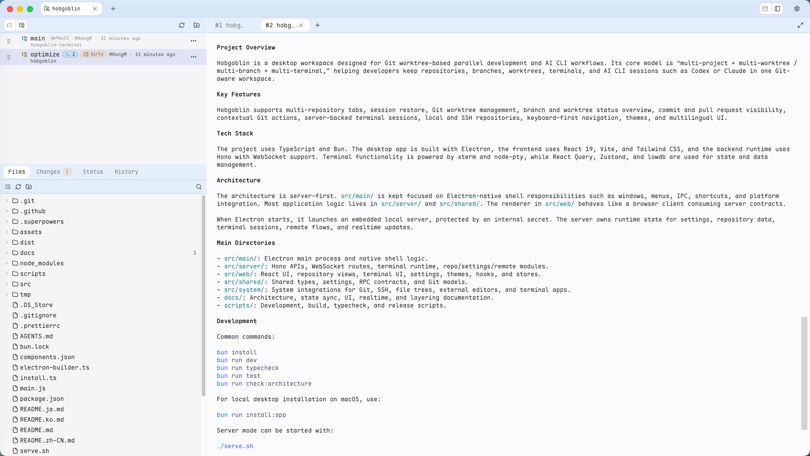
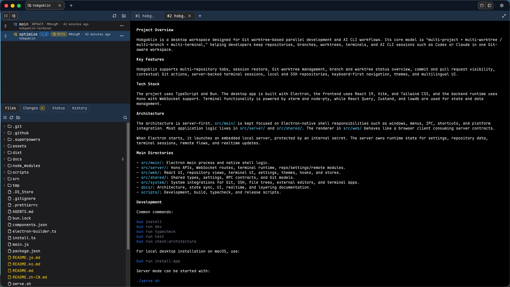

# Hobgoblin

[English](README.md) | [简体中文](README.zh-CN.md) | [한국어](README.ko.md) | 日本語

Hobgoblin は単なるブランチ管理ツールではありません。Git worktree ベースの開発と AI CLI を組み合わせるための高生産性ワークスペースで、デスクトップアプリとしても、ブラウザからアクセスする server mode としても利用できます。

中心になるモデルはシンプルです: **マルチプロジェクト + マルチ worktree / マルチブランチ + マルチターミナル**。複数のリポジトリを開き、並行するブランチを別々の worktree に分離し、適切な文脈にターミナルを紐づけ、Codex や Claude などの AI CLI を Git 状態を見失わずに実行できます。ローカルリポジトリ、Git SSH リモート URL、SSH config alias とリモートパスで開く SSH リモートリポジトリをサポートします。

## スクリーンショット

<p>
  
  
</p>

## 生産性の式

```text
Hobgoblin = マルチプロジェクト x マルチ worktree / マルチブランチ x マルチターミナル
```

意図しているワークフローは、各プロジェクト、worktree、ブランチ、ターミナル、AI CLI セッションを、Git 状態を理解できる同じワークスペースに結びつけることです。

## 起源

Hobgoblin は [Goblin](https://nano-props.github.io/goblin/) から始まりました。Goblin は、複数リポジトリの Git ブランチと worktree を一目で把握するための、小さく焦点の絞られた macOS デスクトップアプリです。最初の軽量なブランチ/worktree 概要を試したい場合、Goblin も引き続き見る価値があります。Hobgoblin はその発想を、AI CLI セッション、複数ターミナル、server mode、より広いリポジトリワークフローへ拡張しています。

## 製品の特徴

- **AI CLI 向けワークフロー:** コーディングエージェント、Shell タスク、Git 状態を同じ作業文脈にまとめ、無関係なターミナルウィンドウに分散させません。
- **マルチプロジェクトワークスペース:** リポジトリをタブで開き、並べ替え、前回のセッションを復元します。
- **デスクトップまたは Web ブラウザ:** パッケージ化されたデスクトップアプリとして使うことも、server mode を起動して同じワークスペースをブラウザで開くこともできます。
- **マルチ worktree ブランチ開発:** 並行するブランチ用の worktree を作成・確認し、一つの checkout を汚さずに進められます。
- **ブランチと worktree の概要:** ブランチ状態、worktree 状態、最新コミット、リンクされた Pull Request を一つの画面で確認できます。
- **文脈内の Git 操作:** checkout、pull、push、worktree 作成、外部ツールでブランチを開く、GitHub への移動をサポートします。
- **マルチターミナル実行面:** 複数のサーバー管理ターミナルをワークスペースと対象ブランチ / worktree の文脈に紐づけます。
- **ローカルと SSH リモートリポジトリ:** ローカルパス、SSH clone URL、SSH config alias とリモートパスで開くリモートリポジトリを扱えます。
- **視覚的なワークフロー操作:** 明確な画面コンテキストでブランチ移動、リポジトリ切り替え、Git 操作、外部ツールへの移動を実行できます。
- **テーマと言語:** ライト、ダーク、テーマプリセットに加え、英語、簡体字中国語、韓国語、日本語の UI 文言を提供します。

## マジック操作

- **ターミナル入力へのバイナリ貼り付け:** ターミナル入力欄にバイナリのクリップボード内容を貼り付けると、一時ファイルを作成し、生成されたファイルパスを入力します。
- **ファイルツリーからターミナルへドラッグ:** ファイルツリーのファイルをターミナルへドラッグして、手入力せずに shell-safe なパスを挿入できます。
- **ファイルツリーのファイルをダブルクリック:** ファイルツリー内のファイルをダブルクリックすると、設定済みのエディタでそのファイルを直接開けます。
- **クリップボード連携のファイル操作:** `Ctrl+Shift+V` でクリップボードのテキストをファイルへ書き込み、`Ctrl+Shift+C` でファイルのテキストをシステムクリップボードへコピーできます。
- **ターミナルタブジャンプ:** アクティブなターミナルタブをダブルクリックすると、そのターミナルを最下部までスクロールします。
- **ターミナルからファイルツリーへのナビゲーション:** ターミナル出力で検出されたリポジトリ相対パスをクリックして、ファイルツリー内の該当ファイルを表示できます。
- **ターミナルパスのエディタジャンプ:** ターミナル出力で検出されたリポジトリ相対パス（`path:line` と `path:line:column` に対応）をダブルクリックすると、設定済みエディタで該当する行・列を開けます。
- **tmux ベースのセッション復元:** 利用可能な場合は tmux ベースのリモートターミナルセッションを検出して使用し、リモートターミナル状態を復元可能に保ちます。
- **ブラウザからのプロジェクトアクセス:** server mode を実行し、Web ブラウザからプロジェクトワークスペースを開けます。
- **モバイルでのターミナル引き継ぎ:** ブラウザアクセス可能モードでは、スマートフォンのブラウザからターミナルセッションを引き継ぎ、モバイル環境でも作業を続けられます。

## インストール

[GitHub Releases](https://github.com/MRongM/hobgoblin/releases) から最新ビルドをダウンロードしてください。

プラットフォームに合ったファイルを選びます:

- **macOS Apple Silicon:** `arm64.dmg` ファイルをダウンロードします。
- **macOS Intel:** `x64.dmg` ファイルをダウンロードします。
- **Windows x64:** `.exe` インストーラーをダウンロードします。

現在のビルドは未署名です。

macOS では、Gatekeeper がダウンロード後のアプリをブロックする場合があります。その場合はアプリを右クリックして **開く** を選び、確認してください。インストール後に quarantine フラグを削除することもできます:

```sh
xattr -dr com.apple.quarantine /Applications/Hobgoblin.app
```

Windows では、SmartScreen が未署名インストーラーに警告を出す場合があります。GitHub Release の配布元を信頼できる場合のみ続行してください。

## ローカルビルドとインストール

要件:

- Bun
- Node.js 24+

macOS でデスクトップアプリをビルドしてインストールします:

```sh
bun run install:app
```

このコマンドはホストアーキテクチャ向けの `Hobgoblin.app` をビルドし、`~/Applications` にインストールします。

## 開発

依存関係をインストールし、開発アプリを起動します:

```sh
bun install
bun run dev
```

## Web ブラウザ / Server Mode

Web UI をビルドし、server mode を起動して、ブラウザから Hobgoblin を開きます:

```sh
./serve.sh
```

デフォルトのブラウザ URL:

```text
http://127.0.0.1:32200
```

別のインターフェースやポートで公開する必要がある場合は、待ち受けアドレスを変更できます:

```sh
./serve.sh --host 127.0.0.1 --port 32200
```

## リンク

- [GitHub Pages](https://mrongm.github.io/hobgoblin/)
- [ソースコード](https://github.com/MRongM/hobgoblin)
- [Releases](https://github.com/MRongM/hobgoblin/releases)

## ライセンス

Hobgoblin は MIT ライセンスです。
